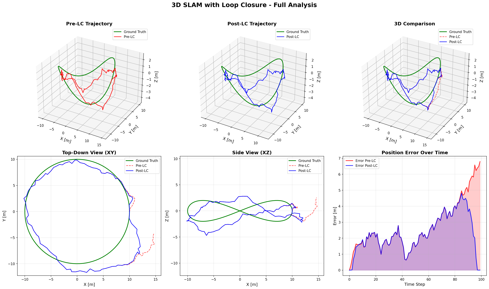

# SLAM 3D Local Simulation

This repository contains a Python-based 3D simulator for a SLAM (Simultaneous Localization and Mapping) loop-closure algorithm. The simulation incorporates drift and sensor noise, performs local optimization, and visualizes the resulting errors and views.

## Features

- **Drift and noise simulation**  
  Introduces realistic drift and sensor noise to the SLAM process.

- **Local optimization**  
  Implements a local optimization algorithm to minimize errors in the SLAM loop.

- **Visualization**  
  - Plots the errors and views after optimization.  
  - Saves the results for further analysis.

An example output plot is shown below:


## Requirements

- Python 3.7 or higher  
- Install dependencies with:

  ```bash
  pip install -r requirements.txt
  ```

## Usage

1. **Clone this repo**  
   ```bash
   git clone https://github.com/maforn/slam-3d-local-simulation.git
   cd slam-3d-local-simulation
   ```

2. **Run the simulation**  
   Execute the main script to start the simulation:

   ```bash
   python main.py
   ```

3. **View results**  
   - The simulation outputs plots of errors and views.  
   - Results are saved in the `slam_output/` directory for further inspection.

## Contributing

Contributions and suggestions are welcome! Feel free to open an issue or submit a pull request.

## License

This project is released under the MIT License. See [LICENSE](LICENSE) for details.
